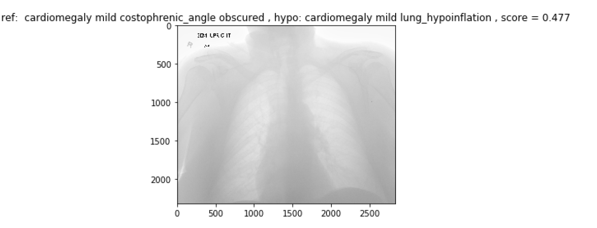

# Chest X-Rays: LSTM Model For Automated Image Annotation

To generate a caption for any image in natural language, English. The architecture for the model is inspired from [1] by Vinyals et al. The module is built using [keras](https://keras.io/), the deep learning library. 

## Model 

    

## Dataset
Indiana University Chest X-ray Collection, [OpenI](https://openi.nlm.nih.gov/gridquery.php?q=&it=xg&coll=cxr)

## Experiments and results
The model has been trained for 50 epochs. With a larger dataset, it might be needed to run the model for atleast 50 more epochs. 

With the current training on the OpenI dataset, running test on the ~200 test images results in,
				`BLEU = ~0.3`.

Some captions generated are as follows:

    

----------------------------------

## Requirements 
- tensorflow
- keras
- numpy
- h5py
- pandas
- Pillow

These requirements can be easily installed by:
	`pip install -r requirements.txt`

## Scripts 

- __caption_generator.py__: The base script that contains functions for model creation, batch data generator etc.
- __prepare_dataset.py__: Prepares the dataset for training.  
- __train_model.py__: Module for training the caption generator.
- __eval_model.py__: Contains module for testing the performance of the caption generator, currently it contains the (BLEU)[https://en.wikipedia.org/wiki/BLEU] metric. New metrics can be added. 

## Usage

After the requirements have been installed, the process from training to testing is fairly easy. The commands to run:
1. `python prepare_dataset.py`
2. `python train_model.py`
3. `python eval_model.py`

----------------------------------

## References 
[1] Oriol Vinyals, Alexander Toshev, Samy Bengio, Dumitru Erhan. [Show and Tell: A Neural Image Caption Generator](https://arxiv.org/pdf/1411.4555.pdf)

[2] A. Karpathy and L. Fei-Fei. [Deep visual-semantic alignments for generating image
descriptions. In CVPR, 2015.](https://cs.stanford.edu/people/karpathy/cvpr2015.pdf)

----------------------------------

