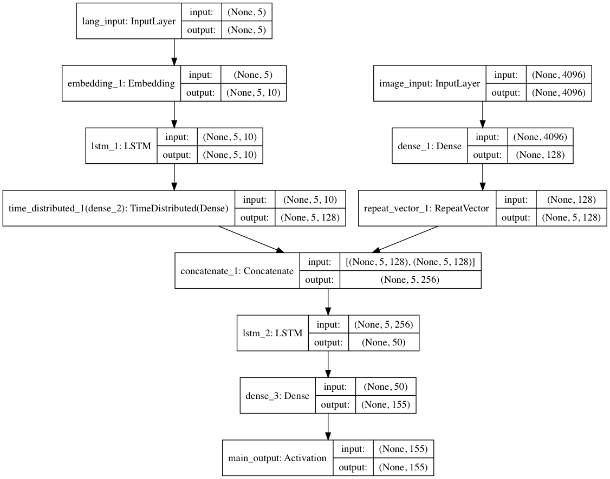

# Chest X-Rays: LSTM Model For Automated Image Annotation

To generate a caption for any image in natural language, English. The architecture for the model is inspired from [1] by Vinyals et al. The module is built using [keras](https://keras.io/), the deep learning library. 

## Model 

    

## Dataset
Indiana University Chest X-ray Collection, [OpenI](https://openi.nlm.nih.gov/gridquery.php?q=&it=xg&coll=cxr)

## Experiments and results
The model has been trained for 50 epochs which lowers down the loss to 2.6465. With a larger dataset, it might be needed to run the model for atleast 50 more epochs. 

With the current training on the Flickr8k dataset, running test on the 1000 test images results in,
				`BLEU = ~0.57`.

Some captions generated are as follows:

    

----------------------------------

## Requirements 
- tensorflow
- keras
- numpy
- h5py
- pandas
- Pillow

These requirements can be easily installed by:
	`pip install -r requirements.txt`

## Scripts 

- __caption_generator.py__: The base script that contains functions for model creation, batch data generator etc.
- __prepare_dataset.py__: Prepares the dataset for training. Changes have to be done to this script if new dataset is to be used. 
- __train_model.py__: Module for training the caption generator.
- __eval_model.py__: Contains module for testing the performance of the caption generator, currently it contains the (BLEU)[https://en.wikipedia.org/wiki/BLEU] metric. New metrics can be added. 

## Usage

After the requirements have been installed, the process from training to testing is fairly easy. The commands to run:
1. `python prepare_dataset.py`
2. `python train_model.py`
3. `python test_model.py`

----------------------------------

## References 
[1] Oriol Vinyals, Alexander Toshev, Samy Bengio, Dumitru Erhan. [Show and Tell: A Neural Image Caption Generator](https://arxiv.org/pdf/1411.4555.pdf)

[2]	Cyrus Rashtchian, Peter Young, Micah Hodosh, and Julia Hockenmaier. Collecting Image Annotations Using Amazon's Mechanical Turk. In Proceedings of the NAACL HLT 2010 Workshop on Creating Speech and Language Data with Amazon's Mechanical Turk.

----------------------------------

## Acknowledgements

[a] I am thankful to my project guide Prof. NK Bansode and a big shoutout to my project teammates. We have also developed an implementation of [1] in TensorFlow available at [image-caption-generator](https://github.com/neural-nuts/image-caption-generator) which had been trained and tested on MS COCO dataset.

[b] Special thanks to [Ashwanth Kumar](https://github.com/ashwanthkumar) for helping me with the resources and effort to train my models. 

[c] [Keras: Deep Learning library for Theano and TensorFlow](https://keras.io/): Thanks to [François Chollet](https://github.com/fchollet) for developing and maintaining such a wonderful library.

[d] [deep-learning-models](https://github.com/fchollet/deep-learning-models): Thanks to [François Chollet](https://github.com/fchollet) for providing pretrained VGG16 model and weights. 

# caption_generator
